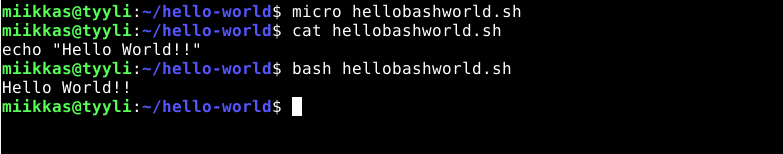

# h13 Task

## Kone

- Lenovo Y510P läppäri
- Suoritin: Intel(R) Core(TM) i7-4700MQ CPU @ 2.40GHz
- 8 GB RAM
- Windows 10, versio: 22H2

## a) Hello World kolmella eri kielellä

Aloitin ~00:02

- Loin kansion tehtävää varten

      $ mkdir hello-world

### Python 3

- Loin python tiedoston micro editorilla

      $ micro helloworld.py

- Tiedoston sisään:

      print("Hello world!")
      
- Tallennus, jonka jälkeen suoritetaan tiedosto.

      $ python3 helloworld.py 
      
Tulos:

### Bash

- Loin tiedoston micro editorilla

      $ micro hellobashworld.sh

- Tiedoston sisään:

      echo "Hello world!!"
      
- Tallennus, jonka jälkeen suoritetaan tiedosto.

      $ bash hellobashworld.py 
      
Tulos:

### C

- Jälleen uutta tiedostoa micro editorilla

      $ micro helloworld.c

- Tiedoston sisään:

      #include <stdio.h>
      int main(){
        printf("Hello World!!!\n");
      }
      
- Tallennus, jonka jälkeen:

      $ gcc helloworld.c -o helloworldc 

- Jonka jälkeen suoritetaan:

       $ ./helloworldc 

Tulos:

## Lähteet 

Karvinen Tero 2018, Hello World Python3, Bash, C, C++, Go, Lua, Ruby, Java – Programming Languages, Luettavissa: https://terokarvinen.com/2018/hello-python3-bash-c-c-go-lua-ruby-java-programming-languages-on-ubuntu-18-04/

Karvinen Tero 2023, h13 Hello world!, Luettavissa: https://terokarvinen.com/2023/linux-palvelimet-2023-alkukevat/#h13-hello-world
