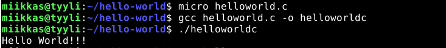

# h13 Task

## Kone

- Lenovo Y510P läppäri
- Suoritin: Intel(R) Core(TM) i7-4700MQ CPU @ 2.40GHz
- 8 GB RAM
- Windows 10, versio: 22H2

## a) Hello World kolmella eri kielellä

Aloitin ~00:02

- Loin kansion tehtävää varten

      $ mkdir hello-world

### Python 3

- Loin python tiedoston micro editorilla

      $ micro helloworld.py

- Tiedoston sisään:

      print("Hello world!")
      
- Tallennus, jonka jälkeen suoritetaan tiedosto.

      $ python3 helloworld.py 
      
Tulos:

### Bash

- Loin tiedoston micro editorilla

      $ micro hellobashworld.sh

- Tiedoston sisään:

      echo "Hello world!!"
      
- Tallennus, jonka jälkeen suoritetaan tiedosto.

      $ bash hellobashworld.py 
      
Tulos:

### C

- Jälleen uutta tiedostoa micro editorilla

      $ micro helloworld.c

- Tiedoston sisään:

      
- Tallennus, jonka jälkeen:

      $ gcc helloworld.c -o helloworldc 

- Jonka jälkeen suoritetaan:

       $ ./helloworldc 

Tulos:

Done ~00:25

## b) Greetme

Aloitin ~00:40

- Loin kotihakemistooni kansion ``bin``, johon teen bash scriptin.

            $ cd
            $ mkdir bin
            
- Siirryin kansioon, jonka jälkeen tein micro editorilla tiedoston ``greetme``

            $ cd bin/
            $ micro greetme
            
- Tiedostoon kirjoitin seuraavan scriptin:

- ``#!/bin/bash`` tiedoston alkuun.

            for name in $@
            do
                  echo "Hello, $name"
            done
          
 - Tämä osa scriptistä ottaa argumentin scriptin suorituksen yhteydessä eli ``greetme`` jälkeen kirjoitettavan argumentin esim. ``greetme Miikka`` komennossa argumentti on  ``Miikka``. Argumentti menee objektiin, joka on scriptissä ``name``. Tämän jälkeen scripti vastaa ``"Hello, $name"`` eli ``Hello Miikka``.
 -  Lopussa oleva ``PATH=...`` määrittelee polun scriptille, joka on ``bin`` kansiossa.
      - Nyt voin suorittaa scriptiä pelkästään sen nimellä eli ``greetme``.
      
 - Jotta scripti toimii pelkällä nimellä käyn lisäämässä ``.bashrc`` tiedostoon polun:
      - Lisätään tiedoston loppuun
      
            export PATH=$PATH:$HOME/bin

Jotta muutokset tulevat varmasti voimaan, kirjaudun vielä ulos käyttäjältä ja uudestaan sisään.

- Testataan toimiiko:

            $ greetme miikka
            
- Scripti vastasi ``bash: /home/miikkas/bin/greetme: Permission denied``
- Katsoin tiedoston oikeudet

            $ ls -l greetme
           

Kuten kuvasta näkee, tiedostolla ei ole oikeuksia suorittamista varten. Teidostolla on pelkästään rw oikeudet eli read ja write. 
- Lisätään execute oikeudet tiedostolle

            $ chmod u+x greetme
       
- Testataan uudestaan toimiiko scripti:

            $ greetme miikka
            

Toimii!

Testaan vielä, että toimii myös kotihakemistossa:

Homma pelaa!

Lopetin tehtävän ~1:55

## Lähteet 

Karvinen Tero 2018, Hello World Python3, Bash, C, C++, Go, Lua, Ruby, Java – Programming Languages, Luettavissa: https://terokarvinen.com/2018/hello-python3-bash-c-c-go-lua-ruby-java-programming-languages-on-ubuntu-18-04/

Karvinen Tero 2023, h13 Hello world!, Luettavissa: https://terokarvinen.com/2023/linux-palvelimet-2023-alkukevat/#h13-hello-world

StackOverflow, How do I run a shell script without using "sh" or "bash" commands?, Luettavissa: https://stackoverflow.com/questions/8779951/how-do-i-run-a-shell-script-without-using-sh-or-bash-commands

FreeCodeCamp, Zaira Hira 2022, Shell Scripting for Beginners – How to Write Bash Scripts in Linux, Luettavissa: https://www.freecodecamp.org/news/shell-scripting-crash-course-how-to-write-bash-scripts-in-linux/
